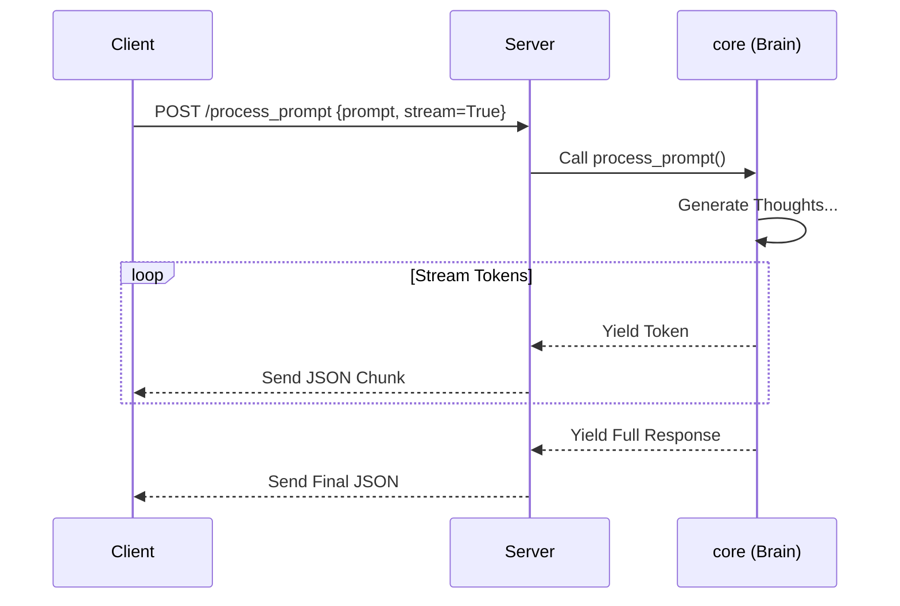

# API Reference

The Orion API is the bridge between the users (Web, Bot, GUI) and the brain (Backend).

## Architecture
The API is built on **FastAPI** and served by **Uvicorn** (via the Launcher).
-   **Protocol**: HTTP/1.1 for standard requests, WebSocket for real-time streams.
-   **Serialization**: JSON for payloads, NDJSON (Newline Delimited JSON) for streaming responses.

## Authentication
Everything begins with a Token.
1.  **Request**: Client POSTs `username/password` to `/api/auth/token`.
2.  **Response**: Server verifies hash and returns a `access_token` (JWT).
3.  **Usage**: Client sends header `Authorization: Bearer <token>` on all subsequent requests.

## Data Flow

