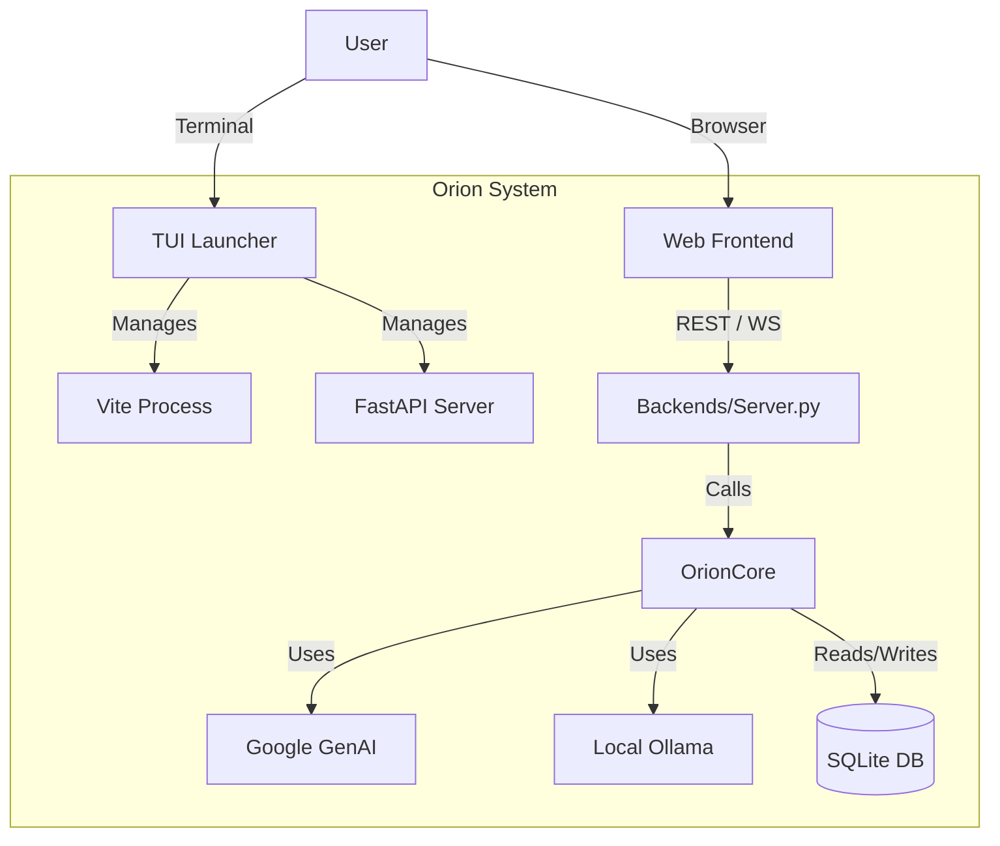

# Architecture Overview

## The Big Picture
Orion is a "Local-First" AI Assistant. It is designed to run entirely on your machine (except for API calls to Google GenAI if enabled), giving you full control over your data and models.

## Component Breakdown

### 1. The Launcher (`launcher_app/`)
The **Launcher** is the "Supervisor". It is a Textual (Python TUI) app.
-   **Role**: It starts the Backend server and the Frontend dev server.
-   **Responsibility**: It captures their logs (stdout/stderr) and displays them in a unified interface. It also manages the ngrok tunnel for remote access.

### 2. The Backend (`backends/`)
The **Backend** is the "Engine". It is a standard FastAPI application.
-   **Server (`server.py`)**: Handles HTTP requests, file uploads, and specific user sessions.
-   **Core (`orion_core.py`)**: This is where the magic happens. It constructs the prompt, manages context windows (short-term memory), and calls the AI model.

### 3. The Frontend (`frontends/web/`)
The **Frontend** is the "Face". It is a modern React application.
-   **Design**: built with Vanilla CSS variables for a premium, dark-mode first aesthetic.
-   **State**: Uses `AuthContext` to manage user identity and `api.js` to communicate with the backend.
